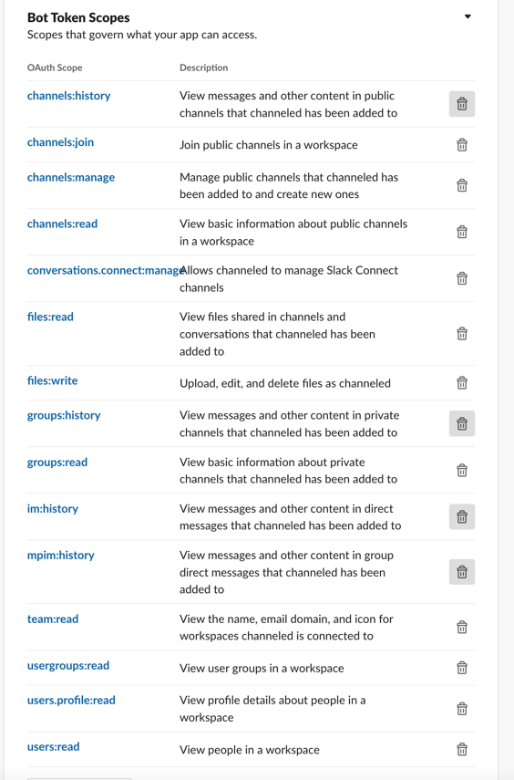
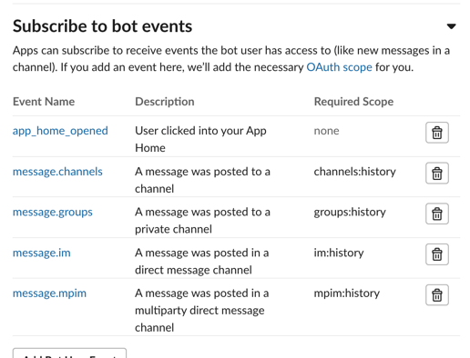

## Channeled demo

### Installation instructions
* Clone the repo
* Run `yarn install` from the root directory
* On Slack's interface create a Slack app and give the following permissions/scopes 
* Enable socket mode on Slack's interface
* While still on Slack's interface, enable events and subscribe to the following bot events 
* Install your app to a workspace
* Create a `.env` file from the `.env.sample` file in the root directory
* Run the app in debug mode with `yarn run debug` or in production mode with `yarn run start`

### Stack
* Node.js
* TypeScript
* Slack Bolt API (TS)